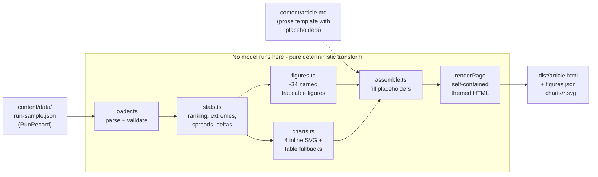
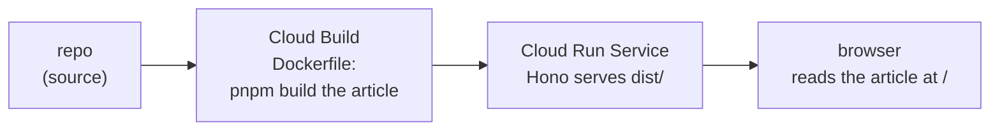

# Eight Agents, One Ticket

Language: **English** | [Espanol](./README.es.md)

A data-driven, reproducible writeup that turns one real multi-agent tournament run
into an accessible HTML article with accessible SVG charts. The headline finding:
the "obvious" strategy did not win.

---

## What this is

This project is a **static article builder**. It reads a single `RunRecord` (the
captured telemetry of one real Implementation Tournament run) and emits a
self-contained HTML page: prose with every number filled in from the data, four
inline SVG bar charts, and data-table fallbacks behind each chart.

The story it tells is honest data journalism about one run. A controller read one
ordinary ticket, fanned it out to six strategy subagents (each building the same
feature in an isolated worktree), and a judge scored the passing lanes against a
fixed rubric. The intuitive pick that an experienced engineer would reach for by
reflex -- `minimal-diff`, the smallest and cheapest change -- finished **3rd**. The
lane that won was `type-safe`. This builder computes that ranking from the data and
narrates it, so the finding is reported honestly as one run's result, not a rate.

### Where the data comes from, and what this builder does NOT do

The run analyzed here (`tournament-2026-07-08-a1b2c3`) was produced by the
**Implementation Tournament**, a sibling project on the **Antigravity 2.0**
platform. That is where agents actually ran, worktrees were built, and scores were
judged.

**This builder runs no model of any kind.** It does not call Gemini, Vertex AI, or
the Antigravity SDK. There is no agent "harness" at runtime here. It is a pure,
deterministic transform: JSON in, HTML out. The file `src/harness.ts` is *only*
three inlined TypeScript type definitions (`RubricWeights`, `LaneRecord`,
`RunRecord`) describing the shape of the input record -- it is not a running
harness. See ["Why no model here"](#why-no-model-here) below; this is deliberate.

---

## What you will learn

Reading and running this project teaches how to turn agent-run telemetry into
honest data journalism:

- **Deriving figures from data with zero hand-typed numbers.** Every figure in the
  prose is a `{{figure:...}}` placeholder resolved from the run record at build
  time. A test proves the article source contains no literal digits at all -- if a
  number appears on the page, it came from the data.
- **Figure traceability.** Each computed figure carries a `source` string (for
  example `run.lanes[2].timeToFirstGreenMs` or `computed`). A test resolves every
  source back against the real record, so no figure can be invented.
- **WCAG-contrast-checked SVG charts with table fallbacks.** Charts are hand-built
  inline SVG using a light/dark palette whose text-on-surface contrast is measured
  with the real WCAG relative-luminance formula and gated at build time. Every chart
  also ships a semantic `<table>` fallback (caption, column and row scopes) inside a
  `<details>` disclosure, so the data is legible without the graphic.
- **Byte-for-byte deterministic builds.** The same input produces the same output
  bytes every time -- no timestamps, no randomness, no network. A test builds twice
  into separate directories and compares every emitted file byte-for-byte.
- **Honest small-sample / n=1 framing.** The run is a single sample. The code carries
  a `cohortN = 1` / `smallSample = true` flag, and the prose reports the result as
  "on this ticket the obvious strategy lost," never as a win rate.

---

## What is built

The pipeline is a straight line of small, pure functions, each in its own module:

| Stage | Module | Responsibility |
|-------|--------|----------------|
| Types | `src/harness.ts` | Three inlined type definitions for the input record (no runtime). |
| Load  | `src/loader.ts` | Read + strictly validate the `RunRecord` JSON (known strategies, numeric fields, winner matches a lane). |
| Stats | `src/stats.ts` | Derive the ranking, extremes, spreads, and deltas. Green lanes ranked by score; red lanes excluded, never ranked. |
| Figures | `src/figures.ts` | Turn stats into ~34 named `FigureEntry` values, each formatted and each carrying a traceable `source`. |
| Format | `src/format.ts` | Pure formatters: `m:ss`, thousands separators, ratios, signed percentages, ordinals. |
| Palette | `src/palette.ts` | Light/dark chart colors + the real WCAG `contrastRatio` implementation. |
| Charts | `src/charts.ts` | Render four accessible inline-SVG bar charts, each with a data-table fallback. |
| Assemble | `src/assemble.ts` | Fill `{{figure:...}}` and `{{chart:N}}` placeholders in the article template, then wrap the body in a self-contained themed HTML page. |
| Build | `src/build.ts` | Orchestrate the pipeline, enforce placeholder closure, write `dist/`, and narrate the run. |
| Server | `src/server.ts` | A tiny Hono static file server to preview `dist/` locally (serves the article at `/`). |

The article itself lives in `content/article.md` -- a template of prose with
`{{figure:...}}` and `{{chart:N}}` placeholders. The input record lives in
`content/data/run-sample.json`. The build asserts **placeholder closure**: every
figure the prose references must exist, and every figure that exists must be used
(no dead figures), and the four chart slots must appear in order.

---

## The build pipeline in detail



Step by step:

1. **Load & validate** (`loader.ts`). The `RunRecord` JSON is parsed and strictly
   validated: the root shape, the rubric weights, every lane field's type, that each
   `strategy` is one of the six known strategies, that `status` is `green` or `red`,
   and that the declared `winner` actually matches a lane. Bad input fails loudly.
2. **Compute stats** (`stats.ts`). Green lanes are ranked by score descending (ties
   broken by leaner diff); red lanes are excluded and never ranked. It derives the
   agent count (`lanes + controller + judge = 6 + 2 = 8`), the diff and token
   extremes and spread ratios, the time-to-green ordering, and the winner-vs-obvious
   benchmark delta. `cohortN` is fixed at 1 and `smallSample` at true.
3. **Build figures** (`figures.ts`). Stats become ~34 named `FigureEntry` records.
   Each has a `formatted` string (what the reader sees) and a `source` (where it
   came from), so every figure is auditable.
4. **Render charts** (`charts.ts`). Four bar charts are drawn as inline SVG with
   `role="img"`, an accessible `<title>`, the winner ringed, and the excluded lane
   drawn as a hatched marker rather than silently dropped. Each chart also produces a
   semantic HTML table fallback.
5. **Assemble** (`assemble.ts`). `{{figure:...}}` placeholders are replaced with the
   formatted values and `{{chart:N}}` slots with the rendered figures; the Markdown
   body is converted to HTML and wrapped in a single self-contained page with inlined
   CSS and a light/dark theme toggle. No external stylesheets, scripts, images, or
   fetches.
6. **Write & narrate** (`build.ts`). Before writing, the build asserts placeholder
   closure. It then writes `dist/article.html`, `dist/figures.json` (the full figure
   manifest), and `dist/charts/chart{1..4}.svg`, and prints a narrated summary
   including a WCAG AA contrast line for both themes. If contrast fails the AA
   threshold, the build throws.

**No model runs at any step.** Every arrow above is a pure function call over local
data.

---

## What it demonstrates

- That a "wow" finding can be reported **honestly**: the counterintuitive result
  (the obvious pick lost) is computed from real telemetry and framed as one run, not
  inflated into a statistic.
- That **reproducibility and accessibility are build-time guarantees**, not manual
  discipline: no hand-typed numbers, every figure traceable, byte-for-byte
  determinism, WCAG-gated contrast, and table fallbacks are all enforced by tests
  and the build itself.
- That a compelling piece of technical content can be a **pure static transform** --
  no model, no runtime, no network -- and still stand on its own as a teaching tool.

---

## How to run

Prerequisites: Node.js >= 22, pnpm >= 9.

```bash
pnpm install
pnpm build      # generates dist/ from the run record
pnpm server     # serves dist/ at http://localhost:8080 (article at /)
```

### What to expect

`pnpm build` narrates the whole transform. This is the real output of a live run:

```
Eight Agents, One Ticket -- static blog build

Run record   : content/data/run-sample.json
  runId      : tournament-2026-07-08-a1b2c3
  lanes      : 6 (5 green, 1 excluded)
  winner     : type-safe (rank 1)
  obvious    : minimal-diff (rank 3)

Figures      : 34 computed from the run record
Charts       : 4 rendered as inline SVG
  - chart1.svg
  - chart2.svg
  - chart3.svg
  - chart4.svg

WCAG AA text : light 19.2:1 PASS, dark 17.4:1 PASS (threshold 4.5:1)

Written to   : dist/
  article.html   24.7 KiB
  figures.json   5.2 KiB
  charts/chart1.svg   3.4 KiB
  charts/chart2.svg   3.5 KiB
  charts/chart3.svg   3.5 KiB
  charts/chart4.svg   3.3 KiB

Build complete. Serve with: pnpm server
```

Note the story in the numbers: the winner (`type-safe`) is rank 1, the obvious pick
(`minimal-diff`) is rank 3, and both theme palettes clear the WCAG AA text threshold
(4.5:1) by a wide margin.

`pnpm server` starts a tiny Hono static server that serves the generated `dist/`
directory, with the article at `/`.

---

## How to test

```bash
pnpm test        # 27 tests across 4 files, all passing
pnpm typecheck   # tsc --noEmit, clean
```

Real result: **27 tests passed** (4 files), **typecheck clean**. The suite is where
the honesty guarantees are enforced. Key assertions:

- **Ranking order (the headline finding).** `stats.test.ts` asserts the green lanes
  rank `type-safe, zero-dependency, minimal-diff, performance-first, most-readable`,
  that the winner is rank 1 and the obvious pick rank 3, and that
  `obviousRank > winnerRank` -- the intuitive pick did not win.
- **Figure traceability.** `figures.test.ts` resolves every figure's declared
  `source` back against the real run record, so no figure is invented.
- **No hand-typed digits.** `build.test.ts` strips the placeholders from the article
  source and asserts that no numeric character remains -- every number on the page
  originates in the data.
- **WCAG contrast.** `charts.test.ts` checks that ink-on-surface clears 4.5:1 and
  bars clear 3:1 in both light and dark themes, using the real luminance formula.
- **Deterministic build.** `build.test.ts` runs the build twice into separate
  directories and asserts every emitted file is byte-for-byte identical.
- **Self-contained, accessible output.** Further `build.test.ts` cases assert the
  HTML has no external references (the only `http` token allowed is the SVG XML
  namespace), and that all four charts carry `role="img"`, an accessible `<title>`,
  and a `<details>` table fallback.

---

## Deploy

Deployed as a **Cloud Run Service** that serves the pre-built article. The container
(built from the repo `Dockerfile`) runs `pnpm build` at image-build time, then serves
`dist/` with the Hono static server.

```bash
gcloud run deploy eight-agents-one-ticket --source .
```

- Project: `ai-experiments-487722`
- Region: `us-central1`
- **Live:** https://eight-agents-one-ticket-z63pqhhmxq-uc.a.run.app (serves the
  article at `/`)



No Vertex AI, no Gemini, and no model of any kind appears in this pipeline: the
container builds a static article and serves static files.

---

## Why no model here

This is a deliberate design choice. The project is a **static analysis of a real
run** -- its entire value is that every number on the page is faithfully derived
from captured telemetry and can be traced back to it. Forcing a model into this
builder would be dishonest: it would invite invented or paraphrased numbers where the
whole point is that no number is invented.

Keeping the transform pure -- JSON in, HTML out, no model, no network,
byte-for-byte deterministic -- is what makes the honesty guarantees testable and the
result reproducible. The agents ran elsewhere (the Implementation Tournament on
Antigravity 2.0); this piece reports what they did, accurately, and stands on its own
as a learning tool for turning agent telemetry into honest data journalism.
