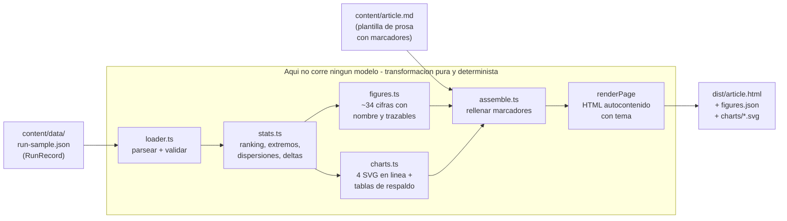
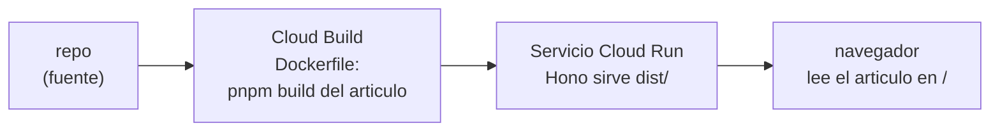

# Ocho agentes, un ticket

> Este codigo se genero con **Antigravity 2.0**, y se reviso y refino con **Antigravity IDE**.

Idioma: **Espanol** | [English](./README.en.md)

Un articulo reproducible y basado en datos que convierte una unica corrida real de
un torneo multiagente en un articulo HTML accesible con graficas SVG accesibles. El
hallazgo principal: la estrategia "obvia" no gano.

## Qué vas a aprender

- Convertir la telemetria de una corrida de agentes en periodismo de datos.
- Emitir HTML y SVG deterministas byte a byte: sin modelo, sin red, sin aleatoriedad.
- Encuadrar una muestra pequena (n=1) como un solo resultado, sin inflarla a una tasa.
- Por que este generador no ejecuta ningun modelo, y por que eso es lo correcto aqui.
- Leer un `RunRecord` y derivar de el cifras trazables y cuatro graficas accesibles.

Cada punto se detalla mas abajo.

---

## Que es esto

Este proyecto es un **generador estatico de articulos**. Lee un unico `RunRecord`
(la telemetria capturada de una corrida real del Implementation Tournament) y emite
una pagina HTML autocontenida: prosa con cada numero rellenado desde los datos,
cuatro graficas de barras SVG en linea, y tablas de datos de respaldo detras de cada
grafica.

La historia que cuenta es periodismo de datos sobre una corrida. Un
controlador leyo un ticket ordinario, lo distribuyo a seis subagentes de estrategia
(cada uno construyendo la misma funcionalidad en un worktree aislado), y un juez
califico los carriles aprobados contra una rubrica fija. La eleccion intuitiva que un
ingeniero con experiencia tomaria por reflejo -- `minimal-diff`, el cambio mas
pequeno y barato -- termino en **3er** lugar. El carril que gano fue `type-safe`.
Este generador computa ese ranking desde los datos y lo narra, de modo que el
hallazgo se reporta como el resultado de una corrida, no como una tasa.

### De donde vienen los datos, y que NO hace este generador

La corrida analizada aqui (`tournament-2026-07-08-a1b2c3`) fue producida por el
**Implementation Tournament**, un proyecto hermano sobre la plataforma
**Antigravity 2.0**. Ahi es donde los agentes realmente se ejecutaron, se
construyeron los worktrees y se juzgaron los puntajes.

**Este generador no ejecuta ningun modelo de ningun tipo.** No llama a Gemini, a
Vertex AI ni al Antigravity SDK. Aqui no hay un "harness" de agentes en tiempo de
ejecucion. Es una transformacion pura y determinista: entra JSON, sale HTML. El
archivo `src/harness.ts` es *solo* tres definiciones de tipos de TypeScript en linea
(`RubricWeights`, `LaneRecord`, `RunRecord`) que describen la forma del registro de
entrada -- no es un harness en ejecucion. Ver ["Por que no hay modelo
aqui"](#por-que-no-hay-modelo-aqui) abajo; esto es deliberado.

---

## Que vas a aprender, en detalle

Leer y ejecutar este proyecto ensena como convertir la telemetria de una corrida de
agentes en periodismo de datos:

- **Derivar cifras desde los datos, con cero numeros escritos a mano.** Cada cifra
  en la prosa es un marcador `{{figure:...}}` resuelto desde el registro de la
  corrida en tiempo de compilacion. Una prueba demuestra que la fuente del articulo
  no contiene ningun digito literal -- si aparece un numero en la pagina, vino de los
  datos.
- **Trazabilidad de cifras.** Cada cifra computada lleva una cadena `source` (por
  ejemplo `run.lanes[2].timeToFirstGreenMs` o `computed`). Una prueba resuelve cada
  fuente contra el registro real, de modo que ninguna cifra puede inventarse.
- **Graficas SVG con contraste verificado por WCAG y tablas de respaldo.** Las
  graficas son SVG en linea construido a mano usando una paleta clara/oscura cuyo
  contraste de texto sobre superficie se mide con la formula real de luminancia
  relativa de WCAG y se controla en tiempo de compilacion. Cada grafica ademas
  incluye una `<table>` semantica de respaldo (caption, alcances de columna y de
  fila) dentro de un `<details>`, de modo que los datos son legibles sin el grafico.
- **Compilaciones deterministas byte a byte.** La misma entrada produce los mismos
  bytes de salida cada vez -- sin marcas de tiempo, sin aleatoriedad, sin red. Una
  prueba compila dos veces en directorios separados y compara cada archivo emitido
  byte a byte.
- **Encuadre de muestra pequena / n=1.** La corrida es una sola muestra. El
  codigo lleva una bandera `cohortN = 1` / `smallSample = true`, y la prosa reporta
  el resultado como "en este ticket la estrategia obvia perdio", nunca como una tasa
  de victoria.

---

## Que se construye

El pipeline es una linea recta de funciones pequenas y puras, cada una en su propio
modulo:

| Etapa | Modulo | Responsabilidad |
|-------|--------|-----------------|
| Tipos | `src/harness.ts` | Tres definiciones de tipos en linea para el registro de entrada (sin runtime). |
| Cargar | `src/loader.ts` | Leer y validar estrictamente el JSON del `RunRecord` (estrategias conocidas, campos numericos, el ganador corresponde a un carril). |
| Estadisticas | `src/stats.ts` | Derivar el ranking, extremos, dispersiones y deltas. Los carriles verdes se rankean por puntaje; los rojos se excluyen, nunca se rankean. |
| Cifras | `src/figures.ts` | Convertir las estadisticas en ~34 valores `FigureEntry` con nombre, cada uno formateado y con un `source` trazable. |
| Formato | `src/format.ts` | Formateadores puros: `m:ss`, separadores de miles, razones, porcentajes con signo, ordinales. |
| Paleta | `src/palette.ts` | Colores de grafica claro/oscuro + la implementacion real de `contrastRatio` de WCAG. |
| Graficas | `src/charts.ts` | Renderizar cuatro graficas de barras en SVG en linea accesible, cada una con tabla de respaldo. |
| Ensamblar | `src/assemble.ts` | Rellenar los marcadores `{{figure:...}}` y `{{chart:N}}` en la plantilla del articulo, y envolver el cuerpo en una pagina HTML autocontenida con tema. |
| Compilar | `src/build.ts` | Orquestar el pipeline, exigir el cierre de marcadores, escribir `dist/` y narrar la corrida. |
| Servidor | `src/server.ts` | Un pequeno servidor estatico Hono para previsualizar `dist/` localmente (sirve el articulo en `/`). |

El articulo en si vive en `content/article.md` -- una plantilla de prosa con
marcadores `{{figure:...}}` y `{{chart:N}}`. El registro de entrada vive en
`content/data/run-sample.json`. La compilacion exige el **cierre de marcadores**:
cada cifra que la prosa referencia debe existir, cada cifra que existe debe usarse
(sin cifras muertas), y los cuatro espacios de grafica deben aparecer en orden.

---

## El pipeline de compilacion en detalle



Paso a paso:

1. **Cargar y validar** (`loader.ts`). El JSON del `RunRecord` se parsea y valida
   estrictamente: la forma raiz, los pesos de la rubrica, el tipo de cada campo de
   carril, que cada `strategy` sea una de las seis estrategias conocidas, que
   `status` sea `green` o `red`, y que el `winner` declarado realmente corresponda a
   un carril. La entrada invalida falla con ruido.
2. **Computar estadisticas** (`stats.ts`). Los carriles verdes se rankean por puntaje
   descendente (empates se rompen por diff mas escueto); los rojos se excluyen y
   nunca se rankean. Deriva el conteo de agentes
   (`carriles + controlador + juez = 6 + 2 = 8`), los extremos y razones de
   dispersion de diff y tokens, el orden de tiempo hasta verde, y el delta de
   benchmark ganador-vs-obvio. `cohortN` se fija en 1 y `smallSample` en verdadero.
3. **Construir cifras** (`figures.ts`). Las estadisticas se vuelven ~34 registros
   `FigureEntry` con nombre. Cada uno tiene una cadena `formatted` (lo que ve el
   lector) y un `source` (de donde vino), de modo que cada cifra es auditable.
4. **Renderizar graficas** (`charts.ts`). Se dibujan cuatro graficas de barras como
   SVG en linea con `role="img"`, un `<title>` accesible, el ganador con un anillo, y
   el carril excluido dibujado como un marcador rayado en lugar de omitirse en
   silencio. Cada grafica ademas produce una tabla HTML semantica de respaldo.
5. **Ensamblar** (`assemble.ts`). Los marcadores `{{figure:...}}` se reemplazan por
   los valores formateados y los espacios `{{chart:N}}` por las figuras renderizadas;
   el cuerpo Markdown se convierte a HTML y se envuelve en una unica pagina
   autocontenida con CSS en linea y un interruptor de tema claro/oscuro. Sin hojas de
   estilo, scripts, imagenes ni peticiones externas.
6. **Escribir y narrar** (`build.ts`). Antes de escribir, la compilacion exige el
   cierre de marcadores. Luego escribe `dist/article.html`, `dist/figures.json` (el
   manifiesto completo de cifras) y `dist/charts/chart{1..4}.svg`, e imprime un
   resumen narrado que incluye una linea de contraste WCAG AA para ambos temas. Si el
   contraste no alcanza el umbral AA, la compilacion arroja error.

**Ningun modelo corre en ningun paso.** Cada flecha de arriba es una llamada a una
funcion pura sobre datos locales.

---

## Que demuestra

- Que un hallazgo "sorprendente" puede reportarse **con precision**: el resultado
  contraintuitivo (la eleccion obvia perdio) se computa desde telemetria real y se
  encuadra como una corrida, no se infla a estadistica.
- Que **reproducibilidad y accesibilidad son garantias de tiempo de compilacion**, no
  disciplina manual: sin numeros escritos a mano, cada cifra trazable, determinismo
  byte a byte, contraste controlado por WCAG y tablas de respaldo estan todos
  impuestos por pruebas y por la propia compilacion.
- Que una pieza convincente de contenido tecnico puede ser una **transformacion
  estatica pura** -- sin modelo, sin runtime, sin red -- y aun asi sostenerse por si
  misma como herramienta de aprendizaje.

---

## Como ejecutar

Requisitos: Node.js >= 22, pnpm >= 9.

```bash
pnpm install
pnpm build      # genera dist/ desde el registro de la corrida
pnpm server     # sirve dist/ en http://localhost:8080 (articulo en /)
```

### Que esperar

`pnpm build` narra toda la transformacion. Esta es la salida real de una corrida en
vivo:

```
Eight Agents, One Ticket -- static blog build

Run record   : content/data/run-sample.json
  runId      : tournament-2026-07-08-a1b2c3
  lanes      : 6 (5 green, 1 excluded)
  winner     : type-safe (rank 1)
  obvious    : minimal-diff (rank 3)

Figures      : 34 computed from the run record
Charts       : 4 rendered as inline SVG
  - chart1.svg
  - chart2.svg
  - chart3.svg
  - chart4.svg

WCAG AA text : light 19.2:1 PASS, dark 17.4:1 PASS (threshold 4.5:1)

Written to   : dist/
  article.html   24.7 KiB
  figures.json   5.2 KiB
  charts/chart1.svg   3.4 KiB
  charts/chart2.svg   3.5 KiB
  charts/chart3.svg   3.5 KiB
  charts/chart4.svg   3.3 KiB

Build complete. Serve with: pnpm server
```

Nota la historia en los numeros: el ganador (`type-safe`) es rango 1, la eleccion
obvia (`minimal-diff`) es rango 3, y ambas paletas de tema superan el umbral de texto
WCAG AA (4.5:1) por un amplio margen.

`pnpm server` inicia un pequeno servidor estatico Hono que sirve el directorio
`dist/` generado, con el articulo en `/`.

---

## Como probar

```bash
pnpm test        # 27 pruebas en 4 archivos, todas pasan
pnpm typecheck   # tsc --noEmit, limpio
```

Resultado real: **27 pruebas pasaron** (4 archivos), **typecheck limpio**. La suite
es donde se imponen las garantias. Aserciones clave:

- **Orden del ranking (el hallazgo principal).** `stats.test.ts` asegura que los
  carriles verdes se rankean `type-safe, zero-dependency, minimal-diff,
  performance-first, most-readable`, que el ganador es rango 1 y la eleccion obvia
  rango 3, y que `obviousRank > winnerRank` -- la eleccion intuitiva no gano.
- **Trazabilidad de cifras.** `figures.test.ts` resuelve el `source` declarado de
  cada cifra contra el registro real de la corrida, de modo que ninguna cifra se
  inventa.
- **Sin digitos escritos a mano.** `build.test.ts` quita los marcadores de la fuente
  del articulo y asegura que no queda ningun caracter numerico -- cada numero en la
  pagina se origina en los datos.
- **Contraste WCAG.** `charts.test.ts` verifica que la tinta sobre superficie supera
  4.5:1 y las barras superan 3:1 en ambos temas, claro y oscuro, usando la formula
  real de luminancia.
- **Compilacion determinista.** `build.test.ts` corre la compilacion dos veces en
  directorios separados y asegura que cada archivo emitido es identico byte a byte.
- **Salida autocontenida y accesible.** Otros casos de `build.test.ts` aseguran que
  el HTML no tiene referencias externas (el unico token `http` permitido es el
  espacio de nombres XML de SVG), y que las cuatro graficas llevan `role="img"`, un
  `<title>` accesible y una tabla de respaldo en `<details>`.

---

## Despliegue

Desplegado como un **Servicio de Cloud Run** que sirve el articulo pre-compilado. El
contenedor (construido desde el `Dockerfile` del repo) ejecuta `pnpm build` en tiempo
de construccion de la imagen, y luego sirve `dist/` con el servidor estatico Hono.

```bash
gcloud run deploy eight-agents-one-ticket --source .
```

- Proyecto: `YOUR_GCP_PROJECT`
- Region: `us-central1`
- **En vivo:** https://eight-agents-one-ticket-z63pqhhmxq-uc.a.run.app (sirve el
  articulo en `/`)



No aparece Vertex AI, ni Gemini, ni ningun modelo de ningun tipo en este pipeline: el
contenedor compila un articulo estatico y sirve archivos estaticos.

---

## Por que no hay modelo aqui

Esto es una decision de diseno deliberada. El proyecto es un **analisis estatico de
una corrida real** -- todo su valor es que cada numero en la pagina se deriva
fielmente de telemetria capturada y puede rastrearse hasta ella. Forzar un modelo
dentro de este generador seria contraproducente: invitaria a numeros inventados o
parafraseados donde el punto entero es que ningun numero se inventa.

Mantener la transformacion pura -- entra JSON, sale HTML, sin modelo, sin red,
determinista byte a byte -- es lo que hace que las garantias sean
verificables y el resultado reproducible. Los agentes corrieron en otra parte (el
Implementation Tournament sobre Antigravity 2.0); esta pieza reporta lo que hicieron,
con precision, y se sostiene por si misma como herramienta de aprendizaje para
convertir telemetria de agentes en periodismo de datos.
